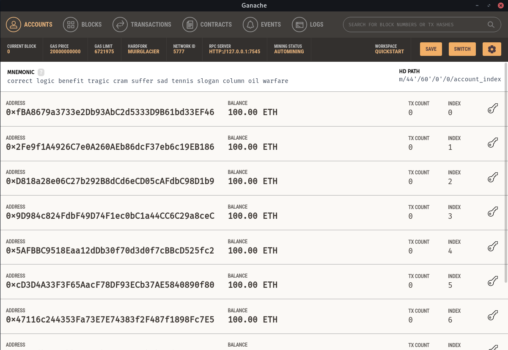

# Solidity Basic Notes App

---

### TODO:

- A small frontend
- Lots of testing
- Some string aux functions :)

---

## What do I need to run this app?

- [Truffle](https://github.com/trufflesuite/truffle)
- [Ganache](https://github.com/trufflesuite/ganache-ui)

### How to install install Truffle.

```
sudo npm install truffle -g
```

### How to install Ganache

```
sudo npm install ganache-cli -g
```

Or, you can download a GUI for Ganache here: https://www.trufflesuite.com/ganache.

## How to run

1. Run the Ganache app.



You will see an Ethereum network with 10 addresses. This is what we will be using to run this app.

2. Deploy the code.
```
truffle deploy
```
Note: You need to run this command in the root directory.

3. Enter the truffle console.

```
truffle console
```

Once you're inside `truffle console`, you can then use the app.

Example:
```
// First, we can create a contract so we can use our public functions.
notesContract = await NotesContract.deployed()

// We can check our address, to see if it is working.
notesContract.address

// We can get our public variables, for example notesCount.
count = await notesContract.getNotesCount()

// This should print "0", since we haven't created any notes yet.
count

// Obviously we can create notes.
await notesContract.createNote("Monday", "I need to learn more about Solidity")
await notesContract.createNote("Tuesday", "Prepare an apple pieeee, and some cupcakes")
await notesContract.createNote("Wednesday", "I need to stop procastinating and learn more about Delay/Disruption Tolerant Networks :)")

// And finally, we can check the content of our notes.
note_0 = await notesContract.notes(0)

// This should print the content of the fist note we created.
note_0

note_1 = await notesContract.notes(1)
note_1

note_2 = await notesContract.notes(2)
note_2
```

